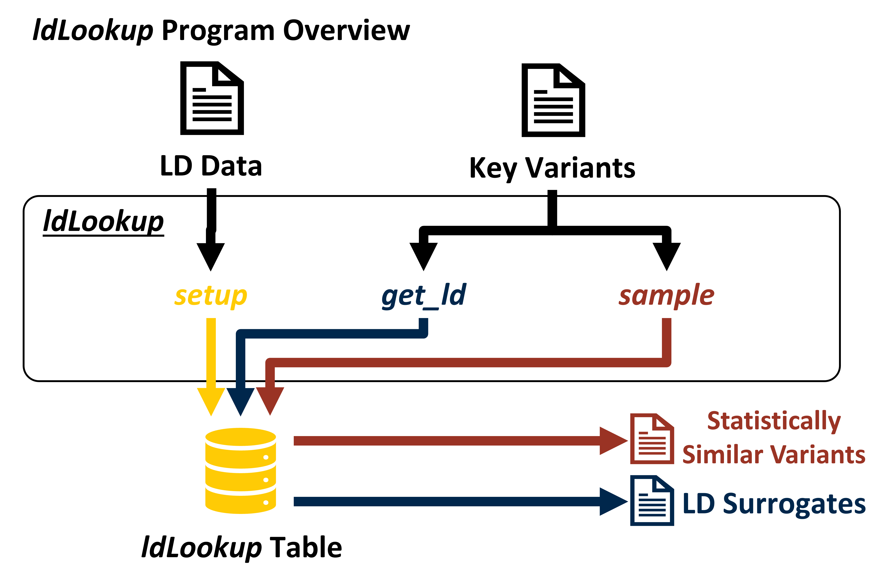

# ldLookup

ldLookup facilitates lookup and analysis of linkage disequilibrium between genetic variants. Its main features include:
- Efficient lookup from genetic variants to their LD surrogates
- Efficient sampling of genetic variants adjusted for MAF and LD
- Compatibility with multiple formats of genetic data
- Scalability to large datasets

## Installation

ldLookup is for Linux (tested on Ubuntu 20.04.2). It requires C\+\+17 or higher and, for automated builds, g\+\+ and make. Install via the command line:
```bash
>>> git clone https://github.com/CutaneousBioinf/Genetics.git
>>> cd Genetics/ldLookup
>>> make
...
>>> ls
... ldLookup ...
```

## Usage
At any time, passing the `-h` or `--help` flags to ldLookup will provide context-aware help messages. For more complete documentation, read on.

ldLookup provides six subcommands. The three in **bold** are most useful:
|        **Subcommand**        |                                                 **Usage**                                                |
|:--------------------------------:|:--------------------------------------------------------------------------------------------------------:|
|           **``setup``**          | Create a new lookup table                                                                                |
|  **``get_variants_in_ld_with``** | Get variants in LD with specified key variants                                                           |
|          **``sample``**          | Randomly sample variants with MAF and number of LD surrogates similar to those of specified key variants |
|    ``get_variants_similar_to``   | Get variants with MAF and number of LD surrogates similar to those of specified key variants             |
| ``get_variants_with_stats_like`` | Get variants with MAF and number of LD surrogates near specified targets                                 |
|    ``get_variant_statistics``    | Get MAF and number of LD surrogates of specified key variants                                            |

A typical workflow looks like this:

<p align="center">
  
</p>
  
### setup
``setup`` uses a file of linkage disequilibrium data to build a lookup table in ldLookup's internal format. A table must be built for each dataset you wish to analyze. ldLookup's other subcommands then query the table to perform their analysis.

```
>>> ./ldLookup setup --help
Create a new lookup table
Usage: ./ldLookup setup [OPTIONS] dir src

Positionals:
  dir TEXT:PATH(non-existing) REQUIRED
                              Directory in which to store the lookup table
  src TEXT:FILE REQUIRED      File from which to read LD data

Options:
  -h,--help                   Print this help message and exit
  --dir TEXT:PATH(non-existing) REQUIRED
                              Directory in which to store the lookup table
  -s,--src TEXT:FILE REQUIRED File from which to read LD data
  -d,--delimiter CHAR=        Character that separates columns of LD data
  -I,--index-id-column TEXT=SNP_A
                              Column of LD data containing index variant IDs
  -L,--ld-id-column TEXT=SNP_B
                              Column of LD data containing IDs for variants in LD with the index variant
  -M,--index-maf-column TEXT=MAF_A
                              Column of LD data containing MAFs of index variants
  -R,--r2-column TEXT=R2      Column of LD data containing r-squared values
  -t,--r2-threshold-for-ld FLOAT:FLOAT in [0 - 1]=0
                              Minimum r-squared value for a variant pair to be considered 'in LD'
[Option Group: ld_bins]
   
  [Exactly 1 of the following options is required]
  Options:
    --index-variants-per-ld-bin UINT:POSITIVE=0
                                Approximate size of each strata when index variants are stratified by number of LD surrogates
    --n-ld-bins UINT:POSITIVE=0 Approximate number of strata when index variants are stratified by number of LD surrogates
[Option Group: maf_bins]
   
  [Exactly 1 of the following options is required]
  Options:
    --index-variants-per-maf-bin UINT:POSITIVE=0
                                Approximate size of each strata when index variants are stratified by MAF
    --n-maf-bins UINT:POSITIVE=0
                                Approximate number of strata when index variants are stratified by MAF
```

**Additional Information:**
- The `src` parameter is typically a path to a .ld file generated by the PLINK software. The file will not be modified. It might look like this:

```
CHR_A BP_A SNP_A MAF_A CHR_B BP_B SNP_B MAF_B R2 
1 11008 1:11008:C:G 0.0884692 1 11012 1:11012:C:G 0.0884692 1 
1 13116 rs201725126:13116:T:G 0.186879 1 13118 rs200579949:13118:A:G 0.186879 1 
1 14599 1:14599:T:A 0.161034 1 14604 1:14604:A:G 0.161034 1 
1 46285 1:46285:ATAT:A 0.000994036 1 66461 1:66461:T:A 0.000994036 1 
1 46285 1:46285:ATAT:A 0.000994036 1 81590 rs202072409:81590:AC:A 0.000994036 1 
```

- The `--delimiter` flag supports different delimiters between columns.

  `--delimiter` defaults to `' ' `, the space character.

  ldLookup treats consecutive delimiters as one delimiter, which works as expected for columns separated by different amounts of whitespace. It does not work as expected for `.csv` files and similar since `A,B,C` and `A,B,,C` are considered identical.

- The flags `--index-id-column`, `--ld-id-column`, `--index-maf-column`, and `--r2-column` support different column orderings.

  Each flag may be passed as an integer that specifies a column index For example, `-I 1` indicates that the first column of src contains index variant IDs.

  If you specify column indices incorrectly, ldLookup may fail to parse your data. This often manifests as `Invalid Line` messages. Note that column indices start counting from 1.

  Alternatively, each flag may be passed as a string that specifies a column name. For example, `-I SNP_A` indicates that the column named `SNP_A` contains index variant IDs.

  If you specify a column name, ldLookup will treat the first row of your data as headers. Note that column names are case sensitive.

- The flag `--r2-threshold-for-ld` sets a minimum value for r-squared. If some row of the input data has an r-squared value at or above this minimum, the variants in that row are considered to be in LD. They will be included in the output of the ``get_variants_in_ld_with`` subcommand.

  ``--r2-threshold-for-ld`` defaults to 0, so it should probably be set.

- The flags ``--index-variants-per-ld-bin``, ``--n-ld-bins``, ``--index-variants-per-maf-bin``, and ``-n-maf-bins`` control sampling granularity. See the ``sample``, ``get_variants_similar_to``, and ``get_variant_statistics`` subcommands.

  Given a particular key variant, ldLookup allows you to find variants with similar MAF and number of LD surrogates (#LDS). The flags above roughly control how close MAF and #LDS must be for two markers to be considered similar.
  
  More specifically, ldLookup splits the input data into bins/strata of roughly uniform size by MAF and #LDS. Then, markers in the same bin/stratum are considered similar. Increasing the number of bins ldLookup creates will decrease the number of variants in each bin and reduce the range of MAF and #LDS that is considered similar. So, increasing ``--n-ld-bins`` or ``--maf-bins`` increases sampling granularity. Likewise, decreasing ``--index-variants-per-ld-bin`` or ``--index-variants-per-maf-bin`` increases sampling granularity.
  
  For example, ``--n-ld-bins 3`` instructs ldLookup to consider markers in the 0th-33rd percentiles for #LDS similar, markers in the 34th-67th percentiles for #LDS similar, and markers in the 67th-100th percentiles for #LDS similar. ``--index-variants-per-maf-bin 5000`` instructs ldLookup to divide the data into groups of 5000 markers by MAF, and consider markers in each group similar.

### Non-Setup Subcommands
``get_variants_in_ld_with``, ``sample``, ``get_variants_similar_to``, and ``get_variant_statistics`` have similar interfaces. Each supports the following options:

- The ``dir`` subcommand specifies the lookup table to operate on. This should be a directory created with the ``setup`` subcommand.

- The ``--key-variants-file`` subcommand is a path to a file that contains newline-separated variant IDs. For each variant ID, ldLookup performs the action specified by the subcommand For example:
```
>>> head id.txt
1:11008:C:G
1:46285:ATAT:A
...
>>> ./ldLookup get_variants_in_ld_with --key-variants-file id.txt
[Variants in LD with 1:11008:C:G...]
[Variants in LD with 1:46285:ATAT:A...]
...
```

- The ``--key-variants`` subcommand allows additional variant IDs to be specified at the command line. After processing variants in the ``--key-variants-file``, ldLookup processes variants specified by ``--key-variants`` in the same way.

  For example, the above command is equivalent to ``./ldLookup get_variants_in_ld_with --key-variants 1:11008:C:G 1:46285:ATAT:A``.

There are deviations from this interface: ``sample`` also supports the ``--n-samples`` option, and ``get_variants_with_stats_like`` has a different interface altogether.

#### get_variants_in_ld_with
``get_variants_in_ld_with`` has the following help text:
```
Get variants in LD with specified key variants
Usage: ./ldLookup get_variants_in_ld_with [OPTIONS] dir [key_variants_file] [key_variants...]

Positionals:
  dir TEXT:DIR REQUIRED       Directory where lookup table is stored
  key_variants_file TEXT:FILE File containing newline-separated index variant IDs
  key_variants TEXT=[] ...    Space-separated index variant IDs

Options:
  -h,--help                   Print this help message and exit
  --dir TEXT:DIR REQUIRED     Directory where lookup table is stored
  -f,--key-variants-file TEXT:FILE
                              File containing newline-separated index variant IDs
  -k,--key-variants TEXT=[] ...
                              Space-separated index variant IDs
```

#### sample
Given a set of input variants, ``sample`` does this:
- For each variant ID _i_ in the input set:
-- Run ``get_variants_similar_to i``. That is, get the set of variants with MAF and number of LD surrogates similar to _i_.
-- Randomly select ``--n-samples`` variants (with replacement) from the set of similar variants.
-- Display the randomly selected variants.

``sample`` has the follwoing help text:
```
>>> ./ldLookup sample --help
Randomly sample variants with MAF and number of LD surrogates similar to those of specified key variants
Usage: ./ldLookup sample [OPTIONS] dir [key_variants_file] [key_variants...]

Positionals:
  dir TEXT:DIR REQUIRED       Directory where lookup table is stored
  key_variants_file TEXT:FILE File containing newline-separated index variant IDs
  key_variants TEXT=[] ...    Space-separated index variant IDs

Options:
  -h,--help                   Print this help message and exit
  --dir TEXT:DIR REQUIRED     Directory where lookup table is stored
  -f,--key-variants-file TEXT:FILE
                              File containing newline-separated index variant IDs
  -k,--key-variants TEXT=[] ...
                              Space-separated index variant IDs
  -n,--n-samples UINT=1       Number of samples to take for each variant
```

#### get_variants_similar_to
```get_variants_similar_to``` has the following help text:
```
>>> ./ldLookup get_variants_similar_to --help
Get variants with MAF and number of LD surrogates similar to those of specified key variants
Usage: ./ldLookup get_variants_similar_to [OPTIONS] dir [key_variants_file] [key_variants...]

Positionals:
  dir TEXT:DIR REQUIRED       Directory where lookup table is stored
  key_variants_file TEXT:FILE File containing newline-separated index variant IDs
  key_variants TEXT=[] ...    Space-separated index variant IDs

Options:
  -h,--help                   Print this help message and exit
  --dir TEXT:DIR REQUIRED     Directory where lookup table is stored
  -f,--key-variants-file TEXT:FILE
                              File containing newline-separated index variant IDs
  -k,--key-variants TEXT=[] ...
                              Space-separated index variant IDs
```

#### get_variants_with_stats_like
```get_variants_with_stats_like``` has the following help text:
```
./ldLookup get_variants_with_stats_like --help
Get variants with MAF and number of LD surrogates near specified targets
Usage: ./ldLookup get_variants_with_stats_like [OPTIONS] dir target_maf target_n_ld_surrogates

Positionals:
  dir TEXT:DIR REQUIRED       Directory where lookup table is stored
  target_maf FLOAT=0 REQUIRED Target MAF value
  target_n_ld_surrogates UINT=0 REQUIRED
                              Target number of LD surrogates

Options:
  -h,--help                   Print this help message and exit
  --dir TEXT:DIR REQUIRED     Directory where lookup table is stored
  -m,--target-maf FLOAT=0 REQUIRED
                              Target MAF value
  -n,--target-n-ld-surrogates UINT=0 REQUIRED
                              Target number of LD surrogates
```

#### get_variant_statistics
```get_variant_statistics``` has the following help text:
```
>>> ./ldLookup get_variant_statistics --help
Get MAF and number of LD surrogates of specified key variants
Usage: ./ldLookup get_variant_statistics [OPTIONS] [dir] [key_variants_file] [key_variants...]

Positionals:
  dir TEXT                    Directory where lookup table is stored
  key_variants_file TEXT:FILE File containing newline-separated index variant IDs
  key_variants TEXT=[] ...    Space-separated index variant IDs

Options:
  -h,--help                   Print this help message and exit
  --dir TEXT                  Directory where lookup table is stored
  -f,--key-variants-file TEXT:FILE
                              File containing newline-separated index variant IDs
  -k,--key-variants TEXT=[] ...
                              Space-separated index variant IDs
```

## Example
Here, we analyze the genetic variant with ID `1:11008:C:G` with all six subcommands. From the below test data, we see that `1:11008:C:G` has one LD surrogate and an MAF of 0.00884692.
```
>>> head data/input.ld
CHR_A BP_A SNP_A MAF_A CHR_B BP_B SNP_B MAF_B R2 
1 11008 1:11008:C:G 0.0884692 1 11012 1:11012:C:G 0.0884692 1 
1 46285 1:46285:ATAT:A 0.000994036 1 66461 1:66461:T:A 0.000994036 1 
1 46285 1:46285:ATAT:A 0.000994036 1 81590 rs202072409:81590:AC:A 0.000994036 1 
1 13116 rs201725126:13116:T:G 0.186879 1 13118 rs200579949:13118:A:G 0.186879 1 
1 14599 1:14599:T:A 0.161034 1 14604 1:14604:A:G 0.161034 1 
1 15274 rs201931625:15274:A:G 0.292247 1 15274 rs201931625:15274:A:T 0.292247 1 
1 15644 1:15644:G:A 0.00795229 1 15774 rs374029747:15774:G:A 0.00795229 1 
1 17571 1:17571:C:T 0.000994036 1 49343 1:49343:T:C 0.000994036 1 
1 49554 1:49554:A:G 0.0636183 1 76838 1:76838:T:G 0.0616302 0.889466 
```

```
>>> ./ldLookup setup --dir my_dataset --src data/input.ld
Did not parse malformed line CHR_A BP_A SNP_A MAF_A CHR_B BP_B SNP_B MAF_B R2 
Did not parse malformed line CHR_A BP_A SNP_A MAF_A CHR_B BP_B SNP_B MAF_B R2 
Did not parse malformed line CHR_A BP_A SNP_A MAF_A CHR_B BP_B SNP_B MAF_B R2
```
```
>>> ./ldLookup get_variants_in_ld_with --dir my_dataset -k 1:11008:C:G
Variant ID      Variant ID of LD Surrogate
1:11008:C:G     1:11012:C:G
```

```
>>> ./ldLookup get_variants_in_ld_with --dir my_dataset -k my_bad_key
Variant ID      Variant ID of LD Surrogate
ERROR:
VectorDiskHash Error
File Path: my_dataset/ld.vdhdat
Table Path: my_dataset/ld.vdhdht
Info: lookup(): Nonexistent Key - my_bad_key
```

```
>>> ./ldLookup sample --dir my_dataset -k 1:11008:C:G --n-samples 10
Sample #        Variant ID      Variant ID of Similar Variant
1       1:11008:C:G     rs4606305:223688399:G:C
2       1:11008:C:G     rs855309:64104099:A:G
3       1:11008:C:G     rs6657296:115737280:C:T
4       1:11008:C:G     rs114181437:60403886:G:A
5       1:11008:C:G     rs113785945:120092283:A:G
6       1:11008:C:G     rs6690609:180136504:C:G
7       1:11008:C:G     rs12406877:230188994:G:A
8       1:11008:C:G     rs77414963:182743849:A:G
9       1:11008:C:G     rs72726326:86040708:A:G
10      1:11008:C:G     rs12568012:5532056:G:C
```

```
./ldLookup get_variant_statistics --dir my_dataset -k 1:11008:C:G
Variant ID      # LD Surrogates MAF
1:11008:C:G     1       0.088469
```

```
>>>./ldLookup get_variants_with_stats_like --dir my_dataset --target-maf 0.08 --target-n-ld-surrogates 1
Target MAF      Target # LD Surrogates  Variant ID
0.08    1       1:11008:C:G
0.08    1       1:60351:A:G
0.08    1       rs184538873:77874:G:A
0.08    1       rs113759966:88316:G:A
0.08    1       rs375955515:89599:A:T
0.08    1       rs7349153:565490:T:C
0.08    1       1:636285:T:C
0.08    1       rs201234755:701779:GAATA:G
0.08    1       rs12131618:732809:T:C
...
```

```
>>> ./ldLookup get_variants_similar_to --dir my_dataset -k 1:11008:C:G
Variant ID      Variant ID of Similar Variant
1:11008:C:G     1:11008:C:G
1:11008:C:G     1:60351:A:G
1:11008:C:G     rs184538873:77874:G:A
1:11008:C:G     rs113759966:88316:G:A
1:11008:C:G     rs375955515:89599:A:T
1:11008:C:G     rs7349153:565490:T:C
1:11008:C:G     1:636285:T:C
1:11008:C:G     rs201234755:701779:GAATA:G
1:11008:C:G     rs12131618:732809:T:C
...
```
